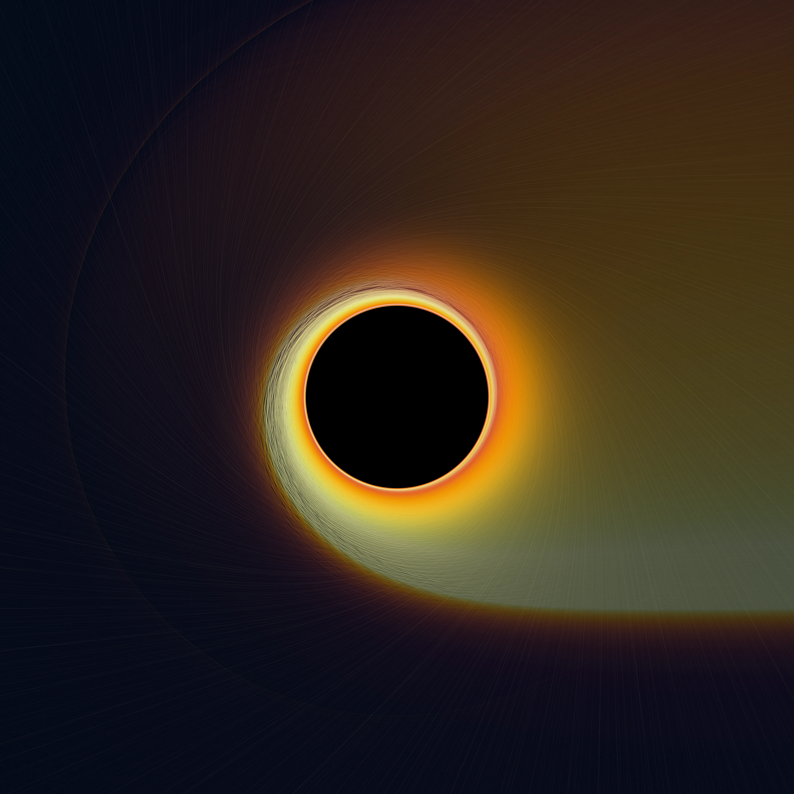

# Geodesic Light: photons in a black-hole spacetime

## What is it?

Python 🐍 code to integrate the null (or light-like) **geodesics** of a **black-hole spacetime** in General Relativity. This means looking at the [**photons**](https://en.wikipedia.org/wiki/Photon) orbiting the (possibly) rotating black hole.

This software derives from the tutorials of the *Black Holes and Neutron Stars* course (Dr. C. Fromm, Dr. R. Gold) at the [ITP of the **Goethe-Universität**](https://www.goethe-university-frankfurt.de/66533451/Welcome_to_the_Institute_for_Theoretical_Physics) (Frankfurt am Main), following the method presented in [Pu et al. (2016)](https://ui.adsabs.harvard.edu/abs/2016ApJ...820..105P/abstract).

Here you can see about **40,000 simulated photons** orbiting a nearly-extremal rotating black hole.

|  | 
|:--:|
| *40,000 photons orbiting a Kerr black hole* |

We can achieve something even more spectacular by increasing the photons to around **200,000**, firing them with different impact parameters to produce different bendings.

|  | 
|:--:|
| *200,000 photons orbiting a Kerr black hole* |

## Relativistic Astrophysics background (geeky section 🤓)

Using geometrised units, $c=G=1$, the [Kerr metric](https://www.roma1.infn.it/teongrav/onde19_20/kerr.pdf) in Boyer-Lindquist coordinates is written as
```math
\mathrm{d}s^{2}=-\left(1-\frac{2Mr}{\Sigma}\right) \mathrm{d}t^{2}-\frac{4aMr\sin^{2}\theta}{\Sigma} \mathrm{d}t \mathrm{d}\phi+\frac{\Sigma}{\Delta} \mathrm{d}r^{2}+\Sigma \mathrm{d}\theta^{2}+\left(r^{2}+a^{2}+\frac{2a^{2}Mr\sin^{2}\theta}{\Sigma}\right) \sin^{2}\theta \mathrm{d}\phi^{2},
```
where $\Sigma\equiv r^2 + a^2 \cos^2 \theta$ and $\Delta\equiv r^2 - 2Mr + a^2$. For simplicity, we will set also $M=1$.

### Initial conditions

To evaluate initial conditions for each photon, we must first set up a relation between an observer located at some distance $r_{\mathrm{obs}}$ and orientation $\theta_{\mathrm{obs}}$, $\phi_{\mathrm{obs}}$ from the black-hole frame. We designate the spatial coordinates for the observer frame by $\mathbf{\alpha}=\left(\alpha, \beta, \gamma\right)$ and initialise them in a way that the $\gamma$-axis points in the $r_{\mathrm{obs}}$ direction; similarly, we adopt $\mathbf{x}=\left(x, y, z\right)$ for the black-hole frame.

Hence, the observer and black-hole frame are related by the transformation
$$\mathbf{x}=\left(\begin{array}{c}
\mathcal{D}(\beta, \gamma) \cos\phi_{\mathrm{obs}} -\alpha\sin\phi_{\mathrm{obs}} \\
\mathcal{D}(\beta, \gamma) \cos\phi_{\mathrm{obs}} + \alpha\cos\phi_{\mathrm{obs}} \\
\left(r_{\mathrm{obs}}-\gamma\right) \cos\theta_{\mathrm{obs}} + \beta\sin\theta_{\mathrm{obs}}
\end{array}\right),$$
with
$$\mathcal{D}\equiv\left(\sqrt{r_{\mathrm{obs}}^{2}+a^{2}}-\gamma\right) \sin\theta_{\mathrm{obs}}-\beta\cos\theta_{\mathrm{obs}}.$$

The conversion from Cartesian to Boyer-Lindquist coordinates is given by
$$\begin{aligned}
r &=\sqrt{\frac{w + \sqrt{w^{2} + 4a^{2}z^{2}}}{2}} \\
\theta &=\arccos \left(\frac{z}{r}\right) \\
\phi &=\arctan\left(y, x \right)
\end{aligned},$$
where $w\equiv x^2 + y^2 + z^2 - a^2$.

We can now consider the velocity of the photon in Boyer-Lindquist coordinates, which can be written as
$$\begin{aligned}
\dot{r} &=-\frac{r \mathcal{R} \sin\theta\sin\theta_{\mathrm{obs}} \cos\Phi + \mathcal{R}^{2} \cos\theta \cos\theta_{\mathrm{obs}}}{\Sigma} \\
\dot{\theta} &=\frac{r \sin\theta \cos\theta_{\mathrm{obs}}-\mathcal{R} \cos\theta \sin\theta_{\mathrm{obs}} \cos\Phi}{\Sigma} \\
\dot{\phi} &=\frac{\sin\theta_{\mathrm{obs}} \sin\Phi}{\mathcal{R} \sin\theta}
\end{aligned},$$
where $\mathcal{R}\equiv \sqrt{r^2 + a^2}$ and $\Phi \equiv \phi - \phi_{\mathrm{obs}}$.

Now we are in a position to compute the initial values for $r,\, \theta,\, \phi,\, t,\, p_r$ and $p_\theta$, required to solve the geodesic equations.

This is implemented by the `initial_conditions` function in the `geodesic_light.core.gr` module.

### Geodesic equations

Now we evaluate the [geodesic equations](https://en.wikipedia.org/wiki/Geodesics_in_general_relativity) for a massless particle in a Kerr spacetime, namely given by
$$\begin{aligned}
\dot{r} &=\frac{\Delta}{\Sigma} p_{r} \\
\dot{\theta} &=\frac{1}{\Sigma} p_{\theta} \\
\dot{\phi} &=\frac{2arE+(\Sigma-2r) L_{z} \csc^{2}\theta}{\Sigma \Delta} \\
\dot{t} &=E+ \frac{2r\left(r^2 + a^2\right) E-2arL_{z}}{\Sigma \Delta} \\
\dot{p}_{r} &=\frac{1}{\Sigma \Delta}\left[-\kappa(r-1) + 2r\left(r^2+a^2\right) E^2 - 2aEL_{z}\right]-\frac{2p_{r}^{2}(r-1)}{\Sigma} \\
\dot{p}_{\theta} &=\frac{\sin\theta \cos\theta}{\Sigma}\left[\frac{L_{z}^{2}}{\sin^4 \theta}-a^2 E^2\right]
\end{aligned},
$$
where $E$ and $L_z$ are the conserved energy and angular momentum of the massless particle, which can be computed from the initial conditions using
$$\begin{aligned}
E^{2} &=\frac{\Sigma-2r}{\Sigma\Delta}\left(\Sigma \dot{r}^2+\Sigma\Delta\dot{\theta}^2\right)+\Delta\dot{\phi}^2\sin ^2 \theta \\
L_{z} &=\frac{(\Sigma\Delta\dot{\phi} - 2arE) \sin^2 \theta}{\Sigma - 2r}
\end{aligned}.$$
The last missing term in the above equations is the Carter constant
$$\kappa\equiv p^2_\theta +L^2_z \csc^2 \theta + a^2 -E^2 \sin^2 \theta.$$

This is implemented by the `ode_ray` function in the `geodesic_light.core.gr` module.

### Integrating the geodesics

Now we can solve the geodesic equations. But, before doing so, we should tell the integrator when it should stop. This is done with two event functions, one stopping the integration when the photon crosses the event horizon, the other one stopping the integration when the photon escapes beyond a specified radius.

It is now possible to compute a ray, solving the initial value problem. This is implemented by the `_trace_single_ray` function in the `geodesic_light.core.rays` module.

To investigate further the behaviour of photons for different impact parameters $b$ (distance between the geodesic and the black hole in the image plane) — following [Gralla et al. (2019)](https://arxiv.org/pdf/1906.00873.pdf) — we define `raytracing`, a function to directly compute several photon geodesics together.

Similar to `raytracing`, the `raytracing_parallel` function (inside the `geodesic_light.core.rays_parallel`) integrates the geodesics in parallel, offering a significant speed-up when at least 8 cores are available.

### Plotting the black hole

Finally, we can visualise the photon trajectories in the equatorial plane, together with the most relevant features of the black hole. These include the **Event Horizon** (EH), defined by
$$r_{\mathrm{EH}} \equiv M + \sqrt{M^2 - a^2},$$
as well as a set of overlaid photon rings—thin, bright structures formed by light rays that orbit the black hole multiple times before escaping.

Photon geodesics are integrated in the equatorial plane, $\theta = \pi/2$, and are coloured according to their winding parameter,
$$n\equiv \phi/2\pi,$$
measuring the total azimuthal angle traversed by the ray in units of full rotations. We can classify the rays based on the value of $n$, using the following scheme:
$$\begin{aligned}
n & <\frac{3}{4} & \mathrm{direct} \\
\frac{3}{4}\leq n & <\frac{5}{4} & \mathrm{lensed} \\
n & \geq \frac{5}{4} &\mathrm{photon\, ring}
\end{aligned}$$
This classification helps distinguish between photons that travel nearly straight paths, those that are deflected around the black hole, and those that orbit it one or more times, contributing to the formation of photon rings.

This is implemented by the `plot_ray_tracing` function in the `geodesic_light.viz.plot` module.